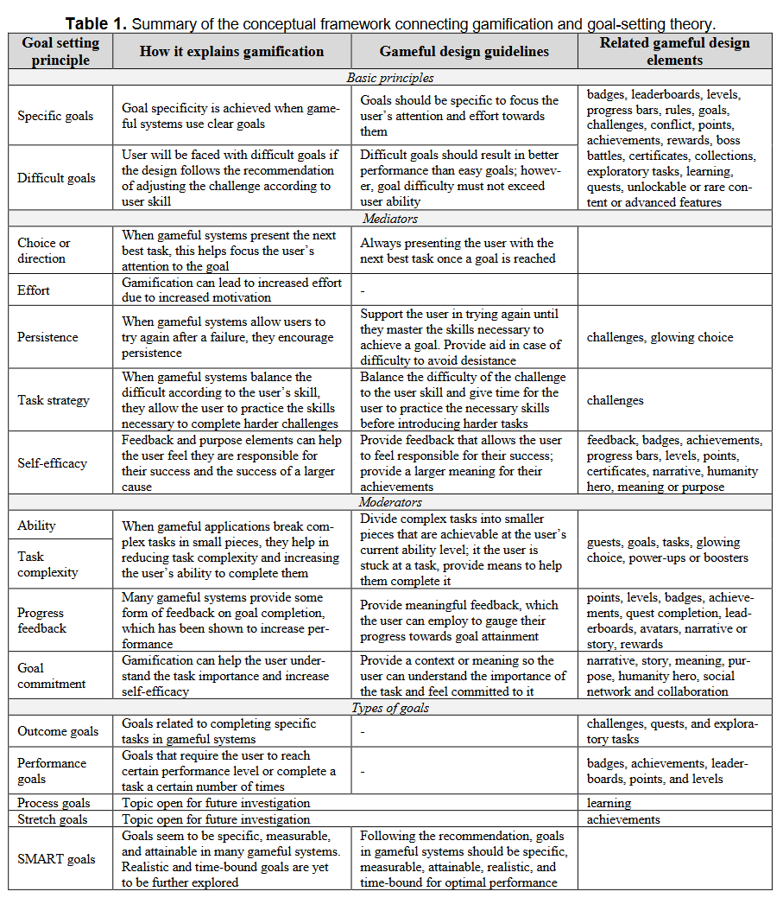

# Gamification
Generally the definition for this topic is "use of gameplay mechanics for non-game applications" however I take issue with this definition. I think when used like this definition implies it is generally coercive and harmful. The definition I'm going to use is: use of game design to create systems of play. I'm using that definition because I am of the belief that while not everything is a "game" removing play from what we do is a technique of alienation. Much of my examination of this topic will be done through the philosophical lens of [[good-gameplay]].

## Gamification in the context of goal-setting theory
From the literature it seems that "creating a goal" is more analogous to designing a gameplay system that provides the player with enough stimulation to do the tasks necessary to achieve the goal in question.

It is suggested by [Gustavo et al.](https://uwspace.uwaterloo.ca/bitstream/handle/10012/13720/2018-A%20Theory%20of%20Gamification%20Principles%20Through%20Goal-Setting%20Theory.pdf?sequence=1&isAllowed=y) that rules, challenges, conflict, leaderboards, levels, progress bars, points, achievements, rewards, boss battles, certificates, collections, exploratory tasks, learning, quests, unlockable or rare content, and unlockable access to advanced features are all concepts that can implemented in gameful design.

Goal  difficulty  in  gameful  systems is  dependent  on  the  system’s  design  and  the matching between the available goals and the user’s skills. Ideally, in a well-designed system, goal difficulty should increase with the user’s  skill  to  always  provide a challenging activity. This would require the ability  to  consistently  monitor  user  skill. Gameful  systems  should  provide difficult  enough  goals  for  each  user,  without  making them  impossible  to  achieve  due  to  a  lack  of  ability, congruent to goal-setting theory. 

In  summary,  many  gameful  applications  and  systems  are  based  on  setting  specific and  difficult  goals. 

## Goal Mechanisms
Goal-setting theory posits that goals affect performance through four mechanisms: choice or direction, effort, persistence, and knowledge or task strategy. Furthermore, self-efficacy as a prominent role in goal-setting theory and there is recent evidence that it can also act as a mediator of goals.
- **Choice or direction**: When an individual has a goal in mind, this helps them orient their attention and effort towards goal-oriented activities and away from those that are irrelevant. Besides specific goals, many gameful systems also present the next best actions that, when executed, will lead to accomplishing the goals. This helps players focus their choices towards goal accomplishment, thus leading to better performance.
- **Effort**: Once an individual chooses a goal and choose to act on it, effort is mobilized in proportion to goal difficulty. One of the goals of employing gamification is increasing the players motivation to carry out the activity and pursue the goals.
- **Persistence**: Studies have shown that a specific and difficult goal leads people to work longer at the task than a vague easy goal. Gameful systems can be designed to provide a safe space for experimentation and learning. 
- **Knowledge or task strategy**: This means that clear and difficult goals cue the individual to bring upon their extant knowledge or skills required to achieve the goals. If the individual currently lacks the necessary knowledge or skills required, this might prevent them from attaining high performance.

More recent research has also shown that causal attribution for performance (either one believes they are directly  responsible  for  their  success  in  achieving  the goals or not) and positive affect  (the  positive  emotions experienced while carrying out the tasks) can influence self-efficacy, and thus, the  level of  goals that the individual  is  willing  to  pursue.  In  gamification,  the feedback  mechanisms  and  the  narrative  can  help  users feel  they  are  directly  responsible for  their success. Moreover,  they  can  also  feel  they  are  part  of  a  something  larger  than  themselves,  helping  they  feel  self-efficacy  in  contributing  to  a  larger  cause;  this  is  often accomplished  by  some  sort  of  narrative  or  theme  that depicts the user as the as a contributor to an “epic goal”.  This  can  contribute  to  increasing both self-efficacy and positive affect. Additionally, gameful  systems  can  potentially  afford  direct  positive emotional  experiences  because  of  the  game  elements with  which  the  user  interacts,  further  contributing to the effect postulated by goal-setting theory.
## Goal Moderators
- **Ability** is a moderator because an individual cannot perform in accordance with a goal when they lack the necessary knowledge or skills. Although performance increases with goal difficulty this effect is diminished if the goals are perceived as impossible.
- As **Task Complexity** increases, goal effects are dependent on the ability to devise appropriate task strategies. Gamification usually solves this problem by breaking challenging goals into smaller ones. Thus a well-designed gameful system should be able to help adjust the challenges to the user skills as well as help users learn new skills, leading the user to always feel competent enough to pursue the presented goals. Moreover, there are two gameful elements that can be particularly helpful in temporarily increasing the user's ability to complete a difficult task: glowing choice (hints or clues for the stuck play) and power-ups or boosters (a limited-time advantage to make a task easier or allow low achieving otherwise impossible goals).
- **Feedback** as a moderator is pretty self explanatory. People need to track their progress towards goal attainment so that they may adjust their strategy and effort accordingly. Progress bars, points, levels, achievements, badges, quest completion, leaderboards, rewards and narratives are concepts that are useful when talking about feedback.
- Finally **goal commitment** or the individuals own determination to accomplish the goal. The effects of goal setting on performance only happen if the individual is really trying to accomplish the goal. Gameful systems that make the player feel like they are collaborating to achieve a common goal through narrative or stories, meaning or purpose, theme, social interaction, collaboration, protection, knowledge sharing, or voting. Gamification can improve the perception of goal importance.
## Types of Goals
- Outcome goals: accomplishment of a very specific result
- Performance goals: doing well be one's own performance standards. 
- Process goals (learning goals): Learning a new skill
- Stretch goals: goals that are difficult and potentially impossible to achieve but stimulate creative thinking.
- Proximal and Distal goals: Proximal goals facilitate the attainment of distal goals. Gamification recommends breaking distant goals into smaller proximal goals to keep the player engaged, improve feedback and encourage learning. Distal goals can be chapters or levels in a game or narrative that represent meaningful achievement when completed whereas proximal goals are quests or tasks that the user must perform and the completion of serval of them lead to the completion of the distal goal.
## Setting optimal goals
 The  community  seems  to  be  reaching  a  consensus that  goals  are  the  most  motivating  for  high  performance  when  they  are  specific,  measurable,  attainable, realistic,  and  time-bound.  Although the  existing  gameful  design  methods  do  not  explicitly reference  “SMART  goals”,  their  best  practices  can help with the setting of goals with these characteristics: 
- Specific:  goals  in  gamification  (e.g.,  quests,  challenges, tasks) usually explain specifically what needs  to  be  done.  Moreover,  most  gameful  design methods posit that goals should always be clear and specific. 
- Measurable:  in  gamification,  it  is  always  possible to  measure  when  a  goal  is  completed  because  the definition of a goal must always be accompanied by the respective definition of how to determine  when it is completed, so the game can advance. 
- Attainable:  most  gameful  design  methods  suggest that the difficulty of the goals should  increase with the  user  skills;  thus,  the  goals  should  always  be achievable if this recommendation is followed. 
- Realistic:  the  system  might  not  be  able  to  evaluate the user’s constraints (which might be external to the system); thus, it might be hard for the system to decide if the goals are realistic. 
- Time-bound: some gameful design methods suggest using  goals  or  tasks  with  time  limits.However, this practice does not seem to be particularly common in gamification. Thus, usually,  goals defined in gamification do not have a specific time when  they  need  to  be  completed.  Considering  that time  limit  is  regarded  by  the  goal-setting  literature as an important characteristic of well-defined goals, it would be interesting to investigate if gameful systems  could  benefit  further  by  setting  time-limited goals more often. 
## Summary of Conceptual Framework
  